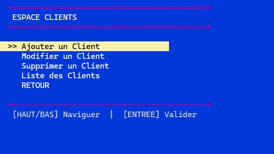
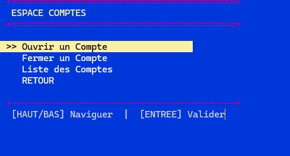
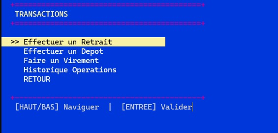
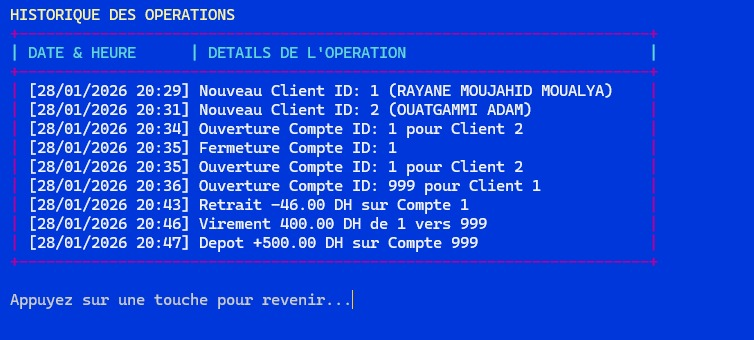

#  Professional Banking System (C Project)

> **End-of-Module Project - Computer Development (S3 MI)**
> *Faculty of Sciences Ben M'Sick - Hassan II University of Casablanca*

---

## 🇬🇧 English Description

### Project Overview
A robust, persistent, and secure banking management system developed entirely in C. This project simulates a professional banking terminal (ATM/Counter) with advanced memory management and a custom user interface.

###  Key Features
- **BIOS-Style Interface:** Custom-built graphical engine (Blue/White theme) with arrow-key navigation using `conio.h` and `windows.h`.
- **Data Persistence:** Automatic serialization of Clients, Accounts, and Audit Logs into CSV files (`.txt`) for data recovery.
- **Security:** Double-factor authentication (PIN code + Balance check) for all financial transactions.
- **Audit Log:** Real-time logging of every critical action with precise timestamps in `historique.txt`.
- **Robustness ("Bug-Free"):** Advanced input sanitization (`clean_stdin`) to prevent buffer overflows and crashes.

###  Technical Stack
- **Language:** C (Standard C99)
- **Libraries:** `stdio`, `stdlib`, `string`, `time`, `windows.h` (UI/Colors), `conio.h` (Input).
- **Core Concepts:** Pointers, Structs, File I/O, Dynamic Memory, Sorting Algorithms.

###  Documentation
For a deep dive into the architecture (UML diagrams), algorithms, and technical choices, please consult the full report:
👉 **[Read the Technical Report (PDF)](./rapport%20de%20projet%20C1.pdf)**

---

## 🇫🇷 Description en Français

### Présentation
Un système de gestion bancaire sécurisé, persistant et interactif, développé entièrement en langage C. Ce projet simule un terminal bancaire professionnel (GAB) avec une gestion avancée de la mémoire et une interface ergonomique.

###  Fonctionnalités Clés
- **Interface Style BIOS :** Moteur graphique personnalisé (Bleu/Blanc) avec navigation par flèches clavier (via `conio.h` et `windows.h`).
- **Persistance des Données :** Sauvegarde automatique des Clients, Comptes et de l'Historique dans des fichiers CSV (`.txt`).
- **Sécurité :** Authentification à double facteur (Vérification Solde + Code PIN) pour toutes les transactions.
- **Audit Log :** Traçabilité complète des opérations avec horodatage dans `historique.txt`.
- **Robustesse ("Bug-Free") :** Gestion blindée des buffers d'entrée (`clean_stdin`) pour empêcher tout crash.

---

##  Interface Preview (Aperçu)

### Main Menu (Navigation Clavier)
.jpeg)

### Client & Account Management
| Client Space | Account Space |
|:---:|:---:|
|  |  |

### Transactions & Audit Logs

---

##  Credits & Academic Supervision

### Development Team
* **MOUJAHID Adam**
* **OUATGAMMI Rayane**
* **BENDAYA Amine**
* **HAMDI Zakariaa**

### Academic Supervision (Encadrement)
This project was realized under the supervision of:

* **Mme ABOURIFA Hanane**
  * *Supervisor (Encadrante)*

* **Mme EL FILALI Sanaa**
  * *Vice Dean (Vice Doyen) & Module Coordinator*

---
*Academic Year 2025/2026*
